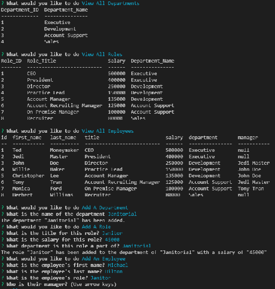

# 12-Employee_Tracker


## Description
This week's assignment is to build a command-line application from scratch to manage a company's employee database, using Node.js, Inquirer, and MySQL.
## User Story

```md
AS A business owner
I WANT to be able to view and manage the departments, roles, and employees in my company
SO THAT I can organize and plan my business
```

## Acceptance Criteria

```md
GIVEN a command-line application that accepts user input
WHEN I start the application
THEN I am presented with the following options: view all departments, view all roles, view all employees, add a department, add a role, add an employee, and update an employee role
WHEN I choose to view all departments
THEN I am presented with a formatted table showing department names and department ids
WHEN I choose to view all roles
THEN I am presented with the job title, role id, the department that role belongs to, and the salary for that role
WHEN I choose to view all employees
THEN I am presented with a formatted table showing employee data, including employee ids, first names, last names, job titles, departments, salaries, and managers that the employees report to
WHEN I choose to add a department
THEN I am prompted to enter the name of the department and that department is added to the database
WHEN I choose to add a role
THEN I am prompted to enter the name, salary, and department for the role and that role is added to the database
WHEN I choose to add an employee
THEN I am prompted to enter the employee’s first name, last name, role, and manager, and that employee is added to the database
WHEN I choose to update an employee role
THEN I am prompted to select an employee to update and their new role and this information is updated in the database 
```

## Mock-Up

[Click for demonstration video](https://drive.google.com/file/d/1OCyveuTijguHbL8F2eZFXITVxfWKnCzH/view)


## Screenshot


## Table of Contents


* [Installation](#installation)
* [Contributing](#contributing)
* [Questions](#questions)


## Installation
***
To begin the user must download the following files - server.js, package.json and all files inside the db folder. Afterwards install node packages "npm install" to receive packages relevant to the application. From the terminal establish your connection and log into mySQL and run the command to upload both schema.sql & seeds.sql files. Once complete you can begin using command line "node server.js" to initiate start up of the app.


## Contributing
***
Myself, Bryan S.


## Questions
***
https://github.com/bsayavong

If you have any further questions please reach out to my email -

bksayavong@gmail.com

## Credits
***
I would like to credit https://www.npmjs.com/ for documentation on the 3 packages required to successfully run this application.